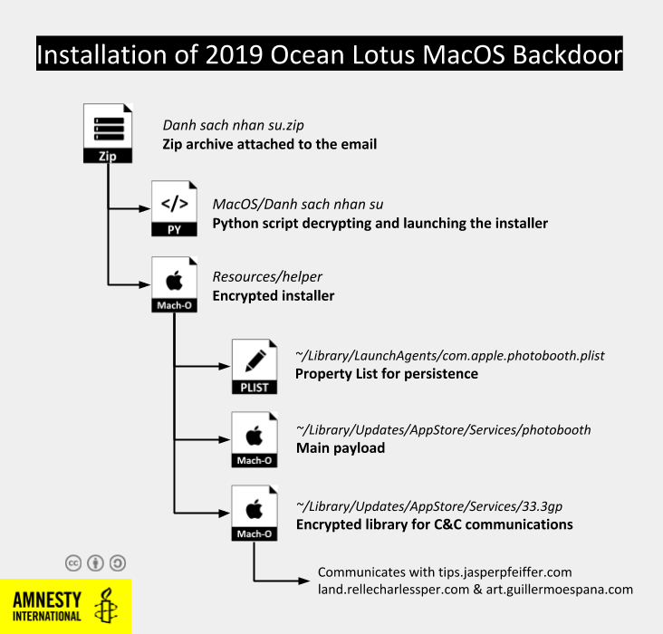
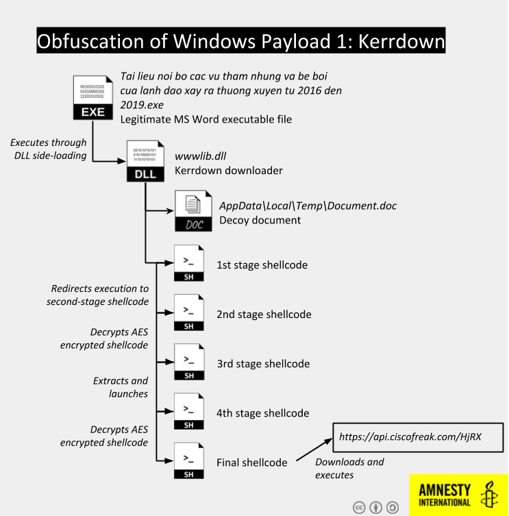
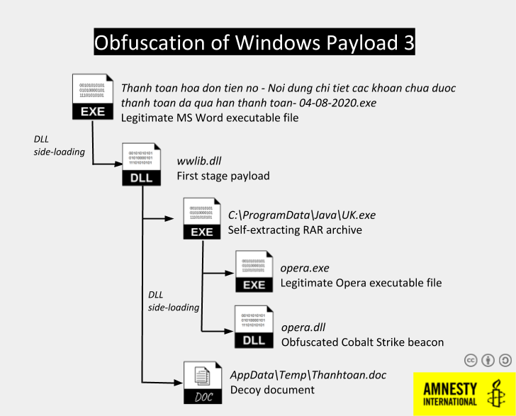

# Overview of Ocean Lotus Samples used to target Vietnamese Human Rights Defenders

From May to November 2020, we have identified malware attacks targeting Human Rights Defenders and organizations from Viet Nam. This technical blog post provides an overview of the different Ocean Lotus samples identified, technical indicators, and details on the link with earlier Ocean Lotus activities. For more information on the context of these attacks and the targets we identified, please read the report entitled [“Click and Bait: Vietnamese Human Rights Defenders Targeted with Spyware Attacks”](https://www.amnesty.org/en/latest/research/2021/02/click-and-bait-vietnamese-human-rights-defenders-targeted-with-spyware-attacks/) on the Amnesty website (also available in Vietnamese).

We found 9 different malware samples in this investigation: 4 for Mac OS, and 5 for Microsoft Windows.

## Mac OS Malware

### First appearance in 2018

The first Mac OS sample we identified targeted Bui Thanh Hieu in February 2018. Attackers delivered a malicious Mac OS application named _“PHIẾU GHI DANH THAM DỰ TĨNH HỘI HMDC 2018”_ attached to an email. This sample belongs to the same family as the Ocean Lotus samples analysed by [Trend Micro in 2018](https://www.trendmicro.com/en_us/research/18/d/new-macos-backdoor-linked-to-oceanlotus-found.html), and they even share the same string encryption algorithm and key.

The malicious application uses a first stage dropper to bypass Apple GateKeeper, then it installs the final payload either in `/Library/CoreMediaIO/Plug-Ins/FCP-DAL/iOSScreenCapture.plugin/Contents/Resources/screenassistantd`, if it is launched with root access, otherwise in `~/Library/Spelling/spellagentd`. The malware gains persistence with a Property List file placed in `~/Library/LaunchAgents/`.

The final payload communicates with the same domains mentioned in the Trend Micro report: `ssl.arkouthrie.com`, `s3.hiahornber.com` and `widget.shoreoa.com`.

### New variants from 2019

In 2019 Bui Thanh Hieu received three more malicious emails with links to or attached malicious Mac OS applications, which are more recent variants of the same malware we described above. However, these variants seem less developed than the samples analysed by [Trend Micro in November 2020](https://www.trendmicro.com/en_us/research/20/k/new-macos-backdoor-connected-to-oceanlotus-surfaces.html), making them likely intermediate versions between those discovered by Trend Micro in 2018 and in 2020.

When executed, these applications launch an installer either embedded in the package or decrypted by a dedicated Python script. The installer disables security protections by removing the _com.apple.quarantine_ bit, launches the final payload and configures persistence by creating a property list in the LaunchAgent user folder, or in the _/Library/LaunchDaemons/_ folder if launched as root.



The installer drops two files in the destination folder: one Mach-O binary payload and an encrypted shared Mach-O library named `[INTEGER].3gp` (such as 33.3gp or 152.3gp). To avoid their discovery during forensic analysis, these files’ creation date and time are faked with the command `touch –t`.

The payload first gathers information on the system, including the MacOS version, the kernel version and details on the hardware and CPU. Then it tries to decrypt all the files in the folder until it finds a shared library exporting the functions `ArchaeologistCodeine` and `PlayerAberadurtheIncomprehensible`. This shared library implements the communication with one of three configured Command & Control (C&C) domains, using libcurl to send POST HTTP requests with an encrypted body.

This malware uses custom base64 and AES algorithms to obfuscate all the strings, making it harder to analyse or build signatures as the encryption keys are changing regularly. In comparison, the 2018 variant used a custom base64 but standard AES, while more recent samples analysed by Trend Micro in 2020 abandoned AES in favour of a custom byte manipulation algorithm.

This backdoor has limited purpose. It allows to manipulate files and execute commands in a terminal. For the full list of supported commands, check [Trend Micro’s report](https://www.trendmicro.com/en_us/research/18/d/new-macos-backdoor-linked-to-oceanlotus-found.html).

## Windows Backdoors

We identified five emails in 2019 and 2020 each containing two files compressed in RAR or ISO archives. The first file is a legitimate copy of Microsoft Word 2007’s executable used for DLL side-loading, while the second is a DLL named wwlib.dll loaded at launch by the Word executable it accompanies.

DLL side-loading is a technique observed [several times](https://unit42.paloaltonetworks.com/tracking-oceanlotus-new-downloader-kerrdown/) used by Ocean Lotus, typically with a Microsoft Word executable. The final payload is always a variant of a downloader used exclusively by Ocean Lotus and [named Kerrdown](https://unit42.paloaltonetworks.com/tracking-oceanlotus-new-downloader-kerrdown/) by the cybersecurity company Palo Alto. All the Kerrdown samples we analysed delivered a Cobalt Strike payload.

### Kerrdown analysis

Kerrdown is a dropper that uses several layers of shellcode to obfuscate the final payload. Each one of them decrypting and redirecting to the next layer, until the final payload is reached.

For instance, the first Kerrdown sample we found in May 2019 used 4 distinct stages before executing the final shellcode that downloads a payload from `api.ciscofreak.com/HjRX` (the domain was down during our investigation, but [this Cobalt Strike beacon](https://www.virustotal.com/gui/file/1cc3f2296f5cd9207f6c84fa9de26dcdbff0b16e49accb0f8dd670ee8d32dd50/detection) uploaded on Virus Total in 2019 communicates with this domain)



These layers of shellcode are different for each Kerrdown sample we discovered, making it challenging to build signatures for this malware family.

One of the samples which targeted the Vietnamese blogger in July 2020 introduced an additional step in the execution. The _wwwlib.dll_ payload installs a binary in `C:\ProgramData\Java\UK.exe`, a self-extractable RAR archive containing a legitimate executable copy of the Opera browser, then used to sideload a malicious DLL called _opera.dll_.

This opera.dll is another variant of the Kerrdown family, but the file itself is exceptionally large (42MB). Expanding payloads with junk data is [a technique](https://attack.mitre.org/techniques/T1027/001/), called “binary padding”, often used by malware to avoid detection by security solutions as some do not analyse large files in depth to avoid performance issues. Binary padding is known to have been used by Ocean Lotus [in the past](https://www.welivesecurity.com/2019/03/20/fake-or-fake-keeping-up-with-oceanlotus-decoys/). This Kerrdown sample includes an obfuscated Cobalt Strike beacon communicating with the domain `delicalo.dnsalias.net`.



### Cobalt Strike

Cobalt Strike is an intrusion toolkit sold by the US company [Strategic Cyber LLC](Strategic Cyber LLC) for penetration testing or adversary simulation. Over the past years, cracked versions of Cobalt Strike have been regularly used by attack groups in their operations. [Cobalt Strike allows](https://www.cobaltstrike.com/features) to remotely monitor a compromised system, including accessing files but also logging keystrokes or taking screenshots.

Ocean Lotus has been known for using Cobalt Strike since [at least 2017](https://www.cybereason.com/blog/operation-cobalt-kitty-apt). The 4 Kerrdown samples we identified all either embedded or downloaded a Cobalt Strike beacon. They all used a Cobalt Strike profile impersonating Google Safe Browsing services URLs, similar to [this public profile](https://github.com/rsmudge/Malleable-C2-Profiles/blob/master/normal/safebrowsing.profile).

The configuration can be easily extracted with the [scripts we released in September 2020](https://github.com/AmnestyTech/investigations/tree/master/2020-09-25_finfisher/scripts/cobaltstrike). Here is an example of configuration for a beacon hosted on `delicalo.dnsalias.net`:

```
dns                            False
ssl                            True
port                           443
.sleeptime                     4100
.http-get.server.output
.jitter                        12
.maxdns                        245
publickey                      30819f300d06092a864886f70d010101050003818d0030818902818100ac50b035fd1b294778b8cbd4ee33323f9b04af158cca225d099052d7987441cbb365ab0f81c4c1190cd8758324e1cb7085dac65ce264dc510c57cfa1d1c7711f26c767d574f04ac16d20a0acf91d4e5dc1cc62c764676b0c38ba50d43953df5184468efdd6b4098c12b5c94be562de22881484accf8e69473621efa95e290f19020301000100000000000000000000000000000000000000000000000000000000000000000000000000000000000000000000000000000000000000000000000000000000000000000000000000000000000000000000000000000000000000000000
.http-get.uri                  delicalo.dnsalias[.]net,/safebrowsing/rd/e3Iz4FnySnhy3IuXKqrWM40JnseSLDHcH-OzVVfWmVgwx
.user-agent                    Mozilla/5.0 (Windows NT 6.1) AppleWebKit/537.36 (KHTML, like Gecko) Chrome/55.0.2883.87 Safari/537.36
.http-post.uri                 /safebrowsing/rd/3KHLhJGZRq4iyImdpSZ5RM90vLo3Yt2hB
.http-get.client
GAccept: text/html,application/xhtml+xml,application/xml;q=0.9,*/*;q=0.8
Accept-Language: en-US,en;q=0.5
Accept-Encoding: gzip, deflaPREF=ID=Cookie
.http-post.client
GAccept: text/html,application/xhtml+xml,application/xml;q=0.9,*/*;q=0.8
Accept-Language: en-US,en;q=0.5
Accept-Encoding: gzip, deflatU=NoncmvrScxBxlwoPREF=ID=Cookie
.post-ex.spawnto_x86           %windir%\syswow64\rundll32.exe
.post-ex.spawnto_x64           %windir%\sysnative\rundll32.exe
.pipename
.cryptoscheme                  1
.dns_idle                      0
.dns_sleep                     0
.http-get.verb                 GET
.http-post.verb                POST
shouldChunkPosts               0
.watermark                     0
.stage.cleanup                 0
CFGCaution                     0
.proxy_type                    2
killdate                       0
text_section                   0
process-inject-start-rwx       64
process-inject-use-rwx         64
process-inject-min_alloc       0
process-inject-transform-x86
process-inject-transform-x64
```

## Indicators of Compromise

### Mac OS samples

| Feb 2018          | |
| ------------- |-------------|
| Package name  | PHIẾU GHI DANH THAM DỰ TĨNH HỘI HMDC 2018 |
| Dropper | 952c16674bde3c16aa3935b3e01f3f0fb4cbac7ffa130143cbf6ccaa72733068 |
| Payload | d3a198e18f8c5e9ed54ed4959b471a0f15fbda7d4abf92b7726bc07723e46dd5 |
| C&C | `ssl.arkouthrie.com` `widget.shoreoa.com` `s3.hiahornber.com` |
| **June 2019**         | |
| Package name | TaiLieu |
| Dropper | ecb6186a5e722fa360ece37191589305858a0e176321c9339831f2884dcb0405 |
| Payload | 1599fe6cc77764c17802cfde1ca77f091bb3ec2a49f6cab1c80ee667ea7c752b |
| Network library | b8567ce4d0595e6466414999798bcb1dfe01cc5ca1dd058bfc55f92033f0f3d8 |
| C&C | `tips.jasperpfeiffer.com` `land.rellecharlessper.com` and `art.guillermoespana.com` |
| **October 2019** | |
| Package Name | Danh sach nhan su |
| Dropper | b252a8d2ec5c7080286fe3f0ad193062f506b5c34c4c797f97717e396c0a22d5 |
| Payload | 9c14cffd79f863fec0a6c0ed337ea82a9044db09afda53b8ac2aef1d49f74f4f |
| Network Library | 5ed6b7b450ead2d0e69faa3069d1e0bd3a6852909092235f75087da0ca05462f |
| C&C | `tips.jasperpfeiffer.com` `land.rellecharlessper.com` and `art.guillermoespana.com` |
| **December 2019** | |
| Package Name | Don keu cuu cua gia dinh Le Nam Tra |
| Dropper | a890c88b6c64371242b4047830b9189b4546536c6b11576d0738f0ba1840ade |
| Payload | 0c41358adeea24d80b35bac4b4f60d93711e32e287343cb604e1fa79b5e5e465 |
| Network Library | 5ed6b7b450ead2d0e69faa3069d1e0bd3a6852909092235f75087da0ca05462f |
| C&C | `tips.jasperpfeiffer.com` `land.rellecharlessper.com` and `art.guillermoespana.com` |

### Windows Samples

| June 2019 |  |
|-----------|--|
| Winword.exe (legitimate) | 6c959cfb001fbb900958441dfd8b262fb33e052342948bab338775d3e83ef7f7 |
| wwlib.dll | 148e647885712b69258967c5f8798966fb9b8ae24847dda8aeb880cb6f56b6da |
| C&C | `api.ciscofreak.com` |
| **April 2020** | |
| Winword.exe (legitimate) | 6c959cfb001fbb900958441dfd8b262fb33e052342948bab338775d3e83ef7f7 |
| wwlib.dll | acb33adf7429424170f63fa5490ed580cf502de4a7ef00e4b8c962425cd85052 |
| C&C | `node.podzone.org` |
| **July 2020** | |
| Winword.exe (legitimate) | 6c959cfb001fbb900958441dfd8b262fb33e052342948bab338775d3e83ef7f7 |
| wwlib.dll | 5cc8d52fcabfd35042336e095f1f78c2b2884e7826358f5385729cf45ce4d860 |
| Opera.exe (legitimate) | 71c3b9538a0f14a8ab67e579ecc4ce2b01e25507d8c07eaf46555e8f44181e37 |
| Opera.dll | a51fb048e5a2730bffd0fd43e3bdda4e931c9358254aff960ddf43526c768120 |
| C&C | `delicalo.dnsalias.net` |
| **November 2020 (2 emails)** | |
| Winword.exe (legitimate) | 6c959cfb001fbb900958441dfd8b262fb33e052342948bab338775d3e83ef7f7 |
| wwlib.dll | a574720e7b4f420098a0ac0055089000435439eb61ec6de2077ac0f782a506e9 |
| C&C | `coco.cechire.com` |


You can find the full list of indicators of compromise [here](https://github.com/AmnestyTech/investigations/tree/master/2021-02-24_vietnam/indicators).
