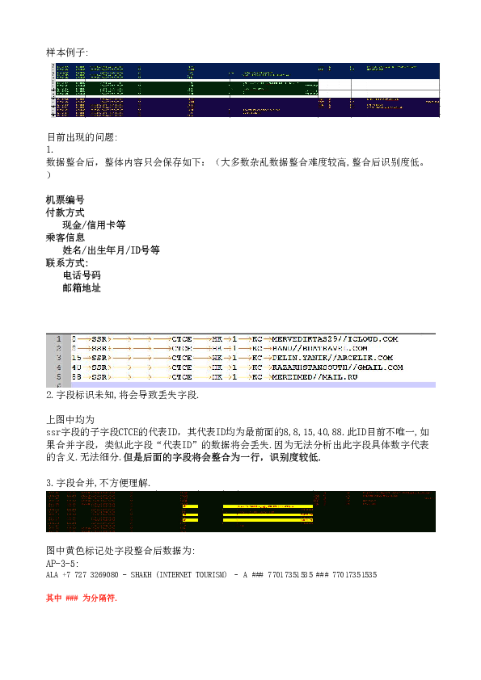
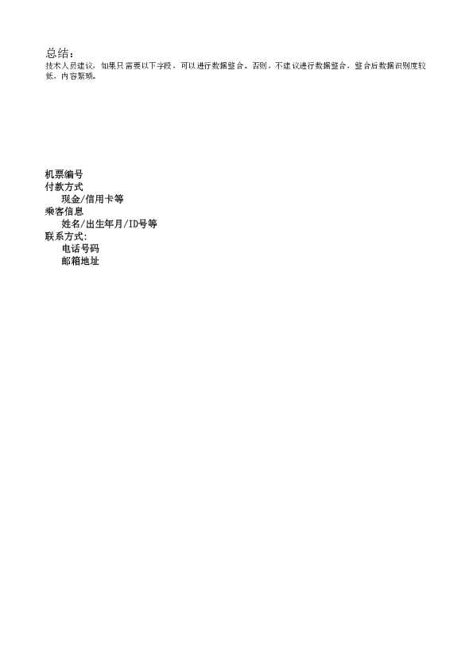

<h3>beeline</h3>
<a href='beeline-77051056626.txt'>beeline-77051056626.txt</a> 
<a href='beeline-77051056626.txt'>beeline-77774042222.txt</a> 
<a href='beeline-77051056626.txt'>beeline-cdr.txt</a> 
<a href='beeline-77051056626.txt'>beeline-crm.txt</a> 
<a href='beeline-77051056626.txt'>beeline-lbs.txt</a> 
<h3>KCELL</h3>
<a href='beeline-77051056626.txt'>77010155050.log</a> 
<a href='beeline-77051056626.txt'>77753527617.log</a> 
<a href='beeline-77051056626.txt'>77783030133.log</a> 
<a href='beeline-77051056626.txt'>LAC.txt</a> 
<a href='beeline-77051056626.txt'>UBSCRIBER.txt</a> 
<h3>TELE2</h3>
<a href='beeline-77051056626.txt'>tele2-cdr.log</a> 
<a href='beeline-77051056626.txt'>tele2-crm.log</a> 
<a href='beeline-77051056626.txt'>tele2-lbs.log</a> 
<h3>哈电信</h3>
<a href='beeline-77051056626.txt'>CRM.txt</a> 
<a href='beeline-77051056626.txt'>IDNET.txt</a> 
<a href='beeline-77051056626.txt'>IDTV.txt</a> 
<a href='beeline-77051056626.txt'>话单.txt</a> 
 
 

